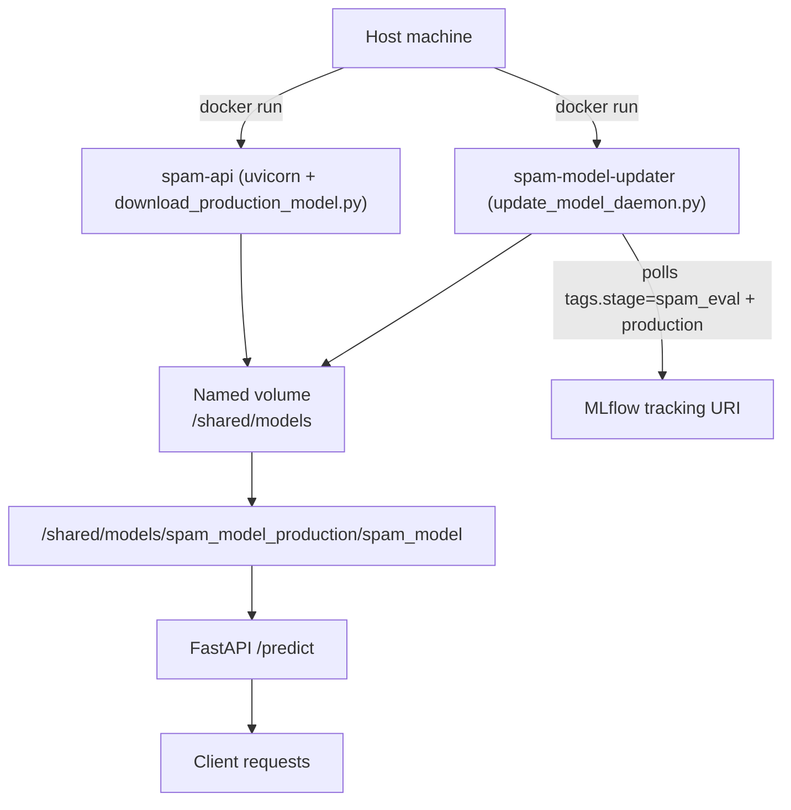

# MLOps_IMDb

<a target="_blank" href="https://cookiecutter-data-science.drivendata.org/">
    
</a>

Film review sentiment analysis.

## Setup Instructions

Follow these steps to set up the project environment and run the complete pipeline:

### Prerequisites

- Python 3.12
- [uv](https://docs.astral.sh/uv/) package manager
- [DVC](https://dvc.org/) for data versioning and pipeline management

### Installation Steps

1. **Clone the repository**
   ```bash
   git clone <repository-url>
   cd MLOps_IMDb
   ```

2. **Create and activate virtual environment**
   ```bash
   make create_environment
   source ./.venv/bin/activate  # On Unix/macOS
   # or
   .\.venv\Scripts\activate     # On Windows
   ```

3. **Install dependencies**
   ```bash
   make requirements
   # or directly with uv
   uv sync
   ```

4. **Run the complete DVC pipeline**
   ```bash
   dvc pull
   dvc repro
   ```

This will execute all pipeline stages in order:
- **prepare**: Clean and preprocess the raw IMDB data
- **features**: Build TF-IDF features from the cleaned text
- **train**: Train the sentiment analysis model
- **eval**: Evaluate the model and generate metrics

### Alternative: Run individual stages

You can also run individual pipeline stages:

```bash
# Data preparation
dvc repro prepare

# Feature engineering
dvc repro features

# Model training
dvc repro train

# Model evaluation
dvc repro eval
```

### Verify Setup

After running the pipeline, you should see:
- Processed data in `data/processed/`
- Trained models in `models/`
- Evaluation metrics in `reports/metrics.json`
- Visualization plots in `reports/figures/`

### Spam Detection Pipeline

The sample spam dataset (tracked via DVC as `data/raw/spam_train.parquet` and `data/raw/spam_test.parquet`) follows the same four-stage pattern but trains a PyTorch LSTM classifier. Pull the raw Parquet files and reproduce the spam stages just like the IMDB pipeline:

```bash
dvc pull -T data/raw/spam_train.parquet data/raw/spam_test.parquet
dvc repro spam_prepare
dvc repro spam_features
dvc repro spam_train
dvc repro spam_eval
```

Key spam artifacts:
- Cleaned CSVs in `data/processed/spam_*_clean.csv`
- Tensorized datasets in `data/processed/spam_*_features.pt`
- Vocab + weights in `models/spam_vocab.json` and `models/spam_model.pt`
- Metrics + plots in `reports/spam_metrics.json` and `reports/figures/spam_confusion_matrix.png`

### Spam inference + updater (Docker)

Two containers share a volume: the FastAPI inference service (which downloads from mlflow the latest model with a production tag at startup) and an optional updater daemon that keeps the volume current when a new MLflow run is tagged production.

```bash
# Build images
docker build -f deployment/spam/Dockerfile -t spam-api --target spam-api .
docker build -f deployment/spam/Dockerfile -t spam-model-updater --target spam-model-updater .

# Shared volume for model artifacts
VOL=spam-model-volume

# Updater: polls MLflow (tags.stage=spam_eval with a production tag) and atomically refreshes the volume
docker run -d --name spam-model-updater \
  -v ${VOL}:/shared/models \
  -e SPAM_MODEL_DIR=/shared/models/spam_model_production \
  -e SPAM_MODEL_POLL_SECONDS=60 \
  spam-model-updater

# Inference: downloads the latest model on boot, then serves /predict
docker run -p 8000:8000 --name spam-api \
  -v ${VOL}:/shared/models \
  -e SPAM_MODEL_URI=/shared/models/spam_model_production/spam_model \
  spam-api
```

Update behavior:
- The updater polls MLflow every `SPAM_MODEL_POLL_SECONDS` (default 300s). When it sees a newer `spam_eval` run with a production tag/label, it downloads into a staging folder and atomically swaps into `SPAM_MODEL_DIR`.
- The inference container only loads the model at startup. After the updater pulls a newer model, restart/roll the inference container to pick up the fresh artifacts.




### Docker Compose (spam + sentiment)

Bring up both APIs plus their updater daemons with a single command:

```bash
cp example.env .env  # fill in MLflow credentials
docker compose -f deployment/docker-compose.yml up --build -d
```

- Spam API -> `http://localhost:8000` using volume `spam-models`
- Sentiment API -> `http://localhost:8001` using volume `sentiment-models`
- UI (Streamlit) -> `http://localhost:8501` (talks to both APIs via service names)
- Override poll cadence via `SPAM_MODEL_POLL_SECONDS` or `SENTIMENT_MODEL_POLL_SECONDS`
- Each pair shares a private network (`spam-net`, `sentiment-net`) so updater and API can talk directly if needed
- Stop everything with `docker compose -f deployment/docker-compose.yml down`

### Development Commands

```bash
# Run tests
make test

# Format code
make format

# Lint code
make lint

# Clean compiled files
make clean
```

## Project Organization

```
├── LICENSE            <- Open-source license if one is chosen
├── Makefile           <- Makefile with convenience commands like `make data` or `make train`
├── README.md          <- The top-level README for developers using this project.
├── data
│   ├── external       <- Data from third party sources.
│   ├── interim        <- Intermediate data that has been transformed.
│   ├── processed      <- The final, canonical data sets for modeling.
│   └── raw            <- The original, immutable data dump.
│
├── docs               <- A default mkdocs project; see www.mkdocs.org for details
│
├── models             <- Trained and serialized models, model predictions, or model summaries
│
├── notebooks          <- Jupyter notebooks. Naming convention is a number (for ordering),
│                         the creator's initials, and a short `-` delimited description, e.g.
│                         `1.0-jqp-initial-data-exploration`.
│
├── pyproject.toml     <- Project configuration file with package metadata for 
│                         mlops_imdb and configuration for tools like black
│
├── references         <- Data dictionaries, manuals, and all other explanatory materials.
│
├── reports            <- Generated analysis as HTML, PDF, LaTeX, etc.
│   └── figures        <- Generated graphics and figures to be used in reporting
│
├── requirements.txt   <- The requirements file for reproducing the analysis environment, e.g.
│                         generated with `pip freeze > requirements.txt`
│
├── setup.cfg          <- Configuration file for flake8
│
└── mlops_imdb   <- Source code for use in this project.
    │
    ├── __init__.py             <- Makes mlops_imdb a Python module
    │
    ├── config.py               <- Store useful variables and configuration
    │
    ├── spam                    <- Spam pipeline modules (prepare/features/train/eval)
    │
    ├── dataset.py              <- Scripts to download or generate data
    │
    ├── features.py             <- Code to create features for modeling
    │
    ├── modeling                
    │   ├── __init__.py 
    │   ├── predict.py          <- Code to run model inference with trained models          
    │   └── train.py            <- Code to train models
    │
    └── plots.py                <- Code to create visualizations
```

--------

