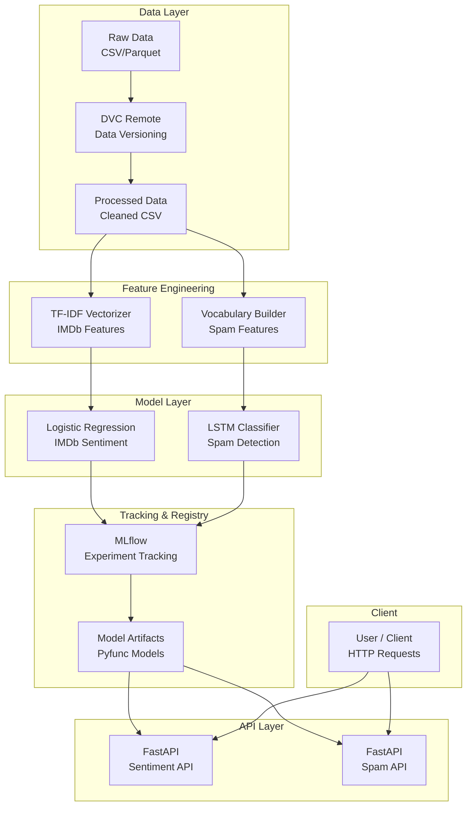
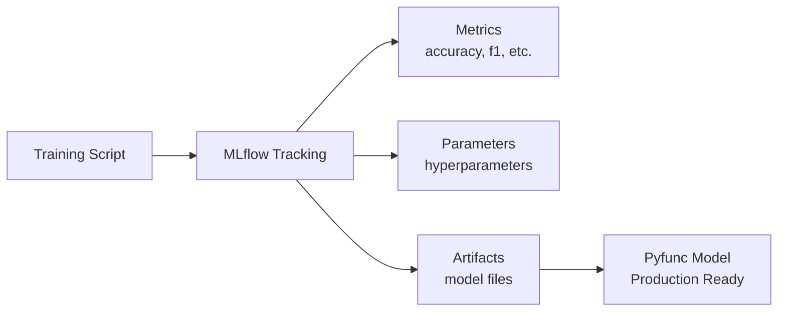
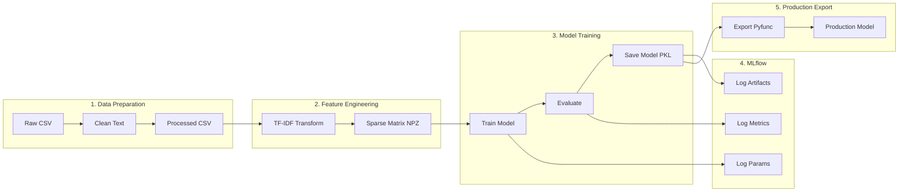
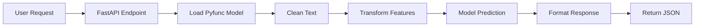

# System Architecture Documentation

## 1. System Overview

This document describes the software architecture of the MLOps IMDb Sentiment Analysis and Spam Detection system. The system is built following MLOps best practices, enabling reproducibility, scalability, and maintainability.

### High-Level Architecture



### Component Summary

| Component | Technology | Purpose |
|-----------|------------|---------|
| Data Versioning | DVC | Track and version large data files |
| Feature Engineering | Scikit-learn, PyTorch | Transform raw text into model inputs |
| IMDb Model | Logistic Regression | Binary sentiment classification |
| Spam Model | LSTM Neural Network | Binary spam detection |
| Experiment Tracking | MLflow | Log metrics, parameters, and artifacts |
| API | FastAPI | Serve predictions via REST endpoints |
| Testing | Pytest | Unit and integration testing |

---

## 2. Component Descriptions

### 2.1 Data Layer

**Location:** `data/`

```
data/
├── raw/                    # Original unprocessed data
│   ├── imdb_train.csv
│   ├── imdb_test.csv
│   ├── spam_train.parquet
│   └── spam_test.parquet
├── processed/              # Cleaned and transformed data
│   ├── imdb_train_clean.csv
│   ├── imdb_test_clean.csv
│   ├── imdb_train_features.npz
│   └── imdb_test_features.npz
└── split_info.json         # Train/test split metadata
```

**Data Pipeline:**
- Raw data is versioned with DVC and stored in remote storage
- Preprocessing applies text cleaning (lowercase, HTML removal, whitespace normalization)
- Features are extracted and stored as sparse matrices (NPZ) or tensors (PT)

### 2.2 Feature Engineering

**IMDb Sentiment (TF-IDF):**
- Location: `mlops_imdb/features/build_features.py`
- Vectorizer: TF-IDF with configurable max features and n-gram range
- Output: Sparse matrices stored in NPZ format

**Spam Detection (Token Embeddings):**
- Location: `mlops_imdb/spam/features.py`
- Tokenization with vocabulary building
- Output: PyTorch tensors with token IDs

### 2.3 Model Layer

**IMDb Sentiment Model:**
- Type: Logistic Regression (Scikit-learn)
- Input: TF-IDF sparse matrix
- Output: Binary classification (0=negative, 1=positive)
- Location: `mlops_imdb/modeling/train.py`

**Spam Detection Model:**
- Type: LSTM Neural Network (PyTorch)
- Architecture: Embedding -> LSTM -> Dropout -> FC -> Sigmoid
- Input: Token ID sequences
- Output: Binary classification (0=not spam, 1=spam)
- Location: `mlops_imdb/spam/train.py`

### 2.4 MLflow Integration

**Experiment Tracking:**
- Logs parameters, metrics, and artifacts for each training run
- Tracks energy consumption via CodeCarbon integration

**Model Registry:**
- Production models are exported as MLflow Pyfunc models
- Enables consistent model loading across environments



### 2.5 API Layer

**FastAPI Endpoints:**

Both APIs follow the same pattern with health checks and prediction endpoints.

| API | Endpoint | Method | Description |
|-----|----------|--------|-------------|
| Sentiment | `/health` | GET | Health check |
| Sentiment | `/predict` | POST | Predict sentiment |
| Spam | `/health` | GET | Health check |
| Spam | `/predict` | POST | Predict spam |

---

## 3. API Specification

### 3.1 Sentiment Analysis API

**Base URL:** `http://localhost:8000`

#### Health Check
```
GET /health
```

**Response:**
```json
{
    "status": "ok",
    "model_uri": "models/sentiment_model_production/sentiment_model"
}
```

#### Predict Sentiment
```
POST /predict
Content-Type: application/json
```

**Request Body:**
```json
{
    "text": "This movie was absolutely fantastic!"
}
```

**Response:**
```json
{
    "probability": 0.92,
    "label": 1,
    "sentiment": "positive"
}
```

| Field | Type | Description |
|-------|------|-------------|
| probability | float | Probability of positive sentiment (0-1) |
| label | int | 0 = negative, 1 = positive |
| sentiment | string | "positive" or "negative" |

### 3.2 Spam Detection API

**Base URL:** `http://localhost:8001`

#### Health Check
```
GET /health
```

**Response:**
```json
{
    "status": "ok",
    "model_uri": "models/spam_model_production/spam_model"
}
```

#### Predict Spam
```
POST /predict
Content-Type: application/json
```

**Request Body:**
```json
{
    "text": "Congratulations! You won a free iPhone!"
}
```

**Response:**
```json
{
    "probability": 0.95,
    "label": 1
}
```

| Field | Type | Description |
|-------|------|-------------|
| probability | float | Probability of spam (0-1) |
| label | int | 0 = not spam, 1 = spam |

---

## 4. Data Flow

### 4.1 Training Pipeline



### 4.2 Inference Pipeline



---

## 5. Deployment Architecture

### 5.1 Cloud Platform Selection

TODO

### 5.2 Deployment Diagram

TODO

### 5.3 Environment Configuration

| Environment Variable | Description | Default |
|---------------------|-------------|---------|
| `SENTIMENT_MODEL_URI` | Path to sentiment model | `models/sentiment_model_production/sentiment_model` |
| `SPAM_MODEL_URI` | Path to spam model | `models/spam_model_production/spam_model` |
| `MLFLOW_TRACKING_URI` | MLflow tracking server URI | `file:mlruns` |

---

## 6. Project Structure

```
MLOps_IMDb/
├── data/                       # Data storage
│   ├── raw/                    # Original data (DVC tracked)
│   └── processed/              # Transformed data
├── docs/                       # Documentation
│   └── architecture.md         # This file
├── mlops_imdb/                 # Main package
│   ├── data/                   # Data preparation modules
│   ├── features/               # Feature engineering
│   ├── modeling/               # IMDb model training, eval, API
│   └── spam/                   # Spam model training, eval, API
├── models/                     # Trained model artifacts
│   ├── sentiment_model_production/
│   └── spam_model_production/
├── reports/                    # Metrics and figures
├── tests/                      # Pytest test suites
├── dvc.yaml                    # DVC pipeline definition
├── params.yaml                 # Pipeline parameters
└── pyproject.toml              # Project configuration
```

---

## 7. Technology Stack

| Category | Technology | Version |
|----------|------------|---------|
| Language | Python | 3.12 |
| ML Framework | Scikit-learn | Latest |
| Deep Learning | PyTorch | Latest |
| API Framework | FastAPI | Latest |
| Experiment Tracking | MLflow | Latest |
| Data Versioning | DVC | Latest |
| Testing | Pytest | Latest |
| Energy Tracking | CodeCarbon | Latest |
| Containerization | Docker | Latest |

---

## 8. Security Considerations

- API endpoints do not require authentication (development mode)
- Model artifacts are stored locally or in private cloud storage
- No sensitive data is logged to MLflow
- Input validation is performed via Pydantic models
